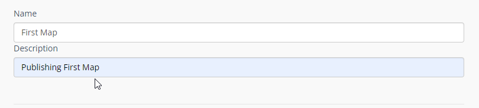
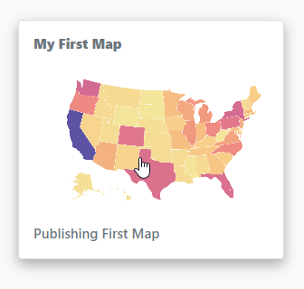
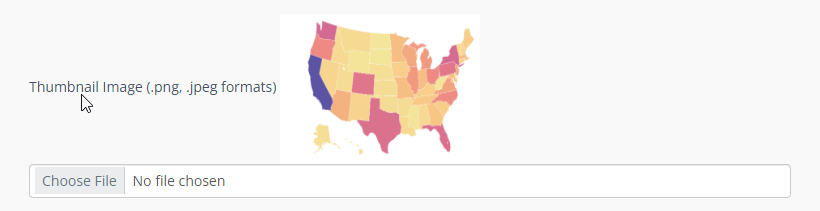
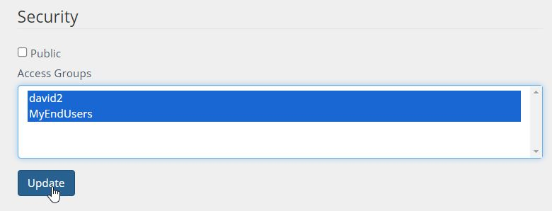
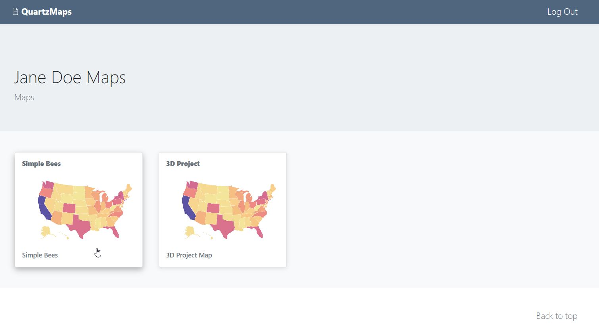
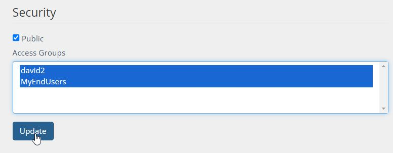

Maps
=====

The Maps page allows you to create and edit Maps.

Create Map
------------

To create a Map, click on "Add New" button.

   .. image:: images/Add-Map.png

Give your map a name and a Description

Select the Project to publish:

   .. image:: images/qwc_map.png

Map Options
--------------

Below are the options availble for each map.

Name
--------------

Give your map a name.  The name will appear as the map title on the dashboard.

Description
--------------

The Description is the text that will appear at the bottom of the map link

Thumbnail Image:
--------------

Upload a thumbnail image for your map to be displayed on the home page.

Security
--------------

Maps can be Private or Public.

The Security section is where you assign permissions to your map.

Security is Group based, so any users belonging to the Group will be able to view the map.

1. Private Maps

Private maps can be viewed by the user logging into your map portal or via Secure Share link (for temporary access)

For example, since we gave access to the Group containing user Jane Doe, when she logs in she will see only the two maps she has permissions to

2. Public Maps

You can also tick the “Public” box to make your map public.

If your map is “Public”, you can use the map url to display the map.

