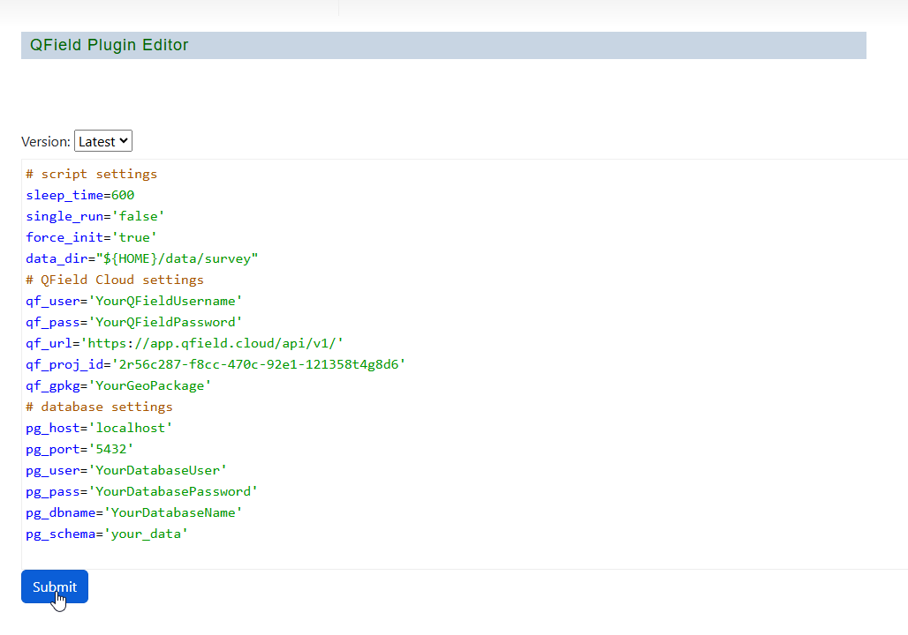
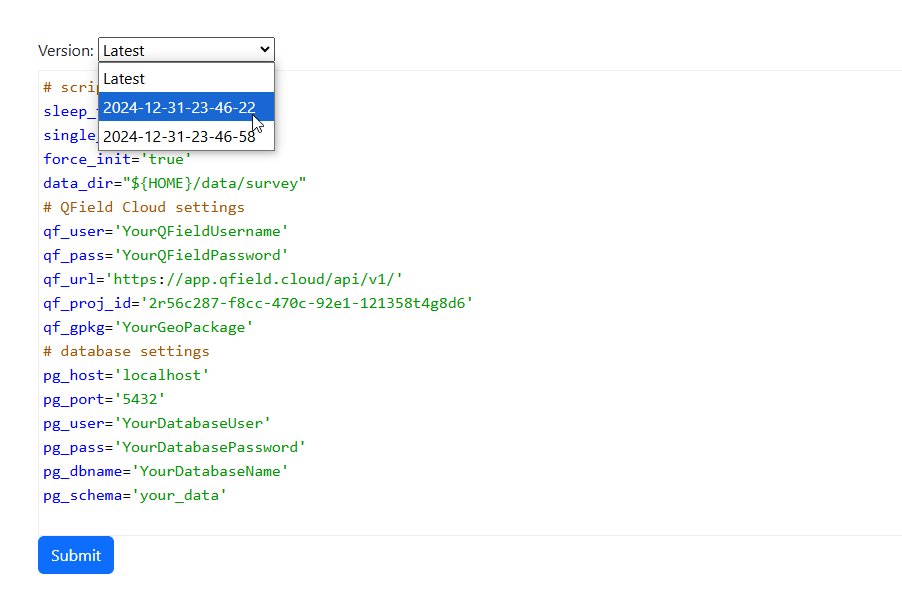

.. This is a comment. Note how any initial comments are moved by
   transforms to after the document title, subtitle, and docinfo.

.. demo.rst from: http://docutils.sourceforge.net/docs/user/rst/demo.txt

.. |EXAMPLE| image:: static/yi_jing_01_chien.jpg
   :width: 1em

************
Parameters
************

.. contents:: Table of Contents

Installation is done via the install scripts located in the /installer directory.

Values
=======================

A default ini is included with installation, survey.ini

The contents are below

.. code-block:: python

   # script settings
   sleep_time=600
   single_run='false'
   force_init='true'
   data_dir="${HOME}/data/survey"
   # QField Cloud settings
   qf_user='YourQFieldUsername'
   qf_pass='YourQFieldPassword'
   qf_url='https://app.qfield.cloud/api/v1/'
   qf_proj_id='2r56c287-f8cc-470c-92e1-121358t4g8d6'
   qf_gpkg='YourGeoPackage'
   # database settings
   pg_host='localhost'
   pg_port='5432'
   pg_user='YourDatabaseUser'
   pg_pass='YourDatabasePassword'
   pg_dbname='YourDatabaseName'
   pg_schema='your_data'

**sleep_time** The amount of time in seconds between checking for updates.

**single_run** Do only one sync run and stop

**force_init** Force initialization process (recreate schema)

Edit
=======================

You can edit an ini file using the plugin editor or manually at /home/qfield/<project>.ini

To edit the file using the plugin, click the edit icon at right for the project

Make any changes and click Submit.

.. warning::

   You must restart the service for your project if you update the ini parameters

Versioning
=======================

Each time an edit is made, the previous version is backed up to disk.

The form of the backup is <project>.ini-TIMESTAMP

You can revert to a previous version by selecting it from the dropdown.
    

plugin-installed.png
quail-qfield-cloud-load-project.png
quail-qfield-cloud-load-project-2.png
quail-qfield-cloud-load-project-3.png
quail-qfield-cloud-load-project-4.png
quail-qfield-cloud-plugin.png
upload-in-progress.png
upload-in-progress-2.png

