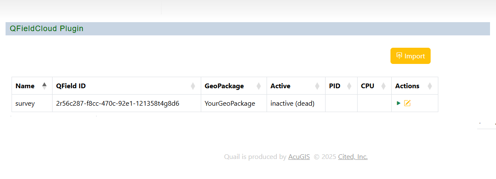

.. This is a comment. Note how any initial comments are moved by
   transforms to after the document title, subtitle, and docinfo.

.. demo.rst from: http://docutils.sourceforge.net/docs/user/rst/demo.txt

.. |EXAMPLE| image:: static/yi_jing_01_chien.jpg
   :width: 1em

************
Parameters
************

.. contents:: Table of Contents

Installation is done via the install scripts located in the /installer directory.

Values
=======================

A default ini is included with installation, survey.ini

The contents are below

.. code-block:: console

   # script settings
   sleep_time=600
   single_run='false'
   force_init='true'
   data_dir="${HOME}/data/survey"
   # QField Cloud settings
   qf_user='YourQFieldUsername'
   qf_pass='YourQFieldPassword'
   qf_url='https://app.qfield.cloud/api/v1/'
   qf_proj_id='2r56c287-f8cc-470c-92e1-121358t4g8d6'
   qf_gpkg='YourGeoPackage'
   # database settings
   pg_host='localhost'
   pg_port='5432'
   pg_user='YourDatabaseUser'
   pg_pass='YourDatabasePassword'
   pg_dbname='YourDatabaseName'
   pg_schema='your_data'

Edit
=======================

Use Git or download the Quail QField Plugin

.. code-block:: console

    git clone https://github.com/AcuGIS/quail-qfield-plugin.git

Versioning
=======================

.. code-block:: console

    cd quail-qfield-plugin
    

Execute the scripts in order.

.. code-block:: console
 
    ./prepare-plugin.sh.sh
    ./install-plugin.sh.sh
    ./set-permissions.sh

Go to QFieldCloud Plugin and verify installation.

plugin-installed.png
quail-qfield-cloud-load-project.png
quail-qfield-cloud-load-project-2.png
quail-qfield-cloud-load-project-3.png
quail-qfield-cloud-load-project-4.png
quail-qfield-cloud-plugin.png
upload-in-progress.png
upload-in-progress-2.png

