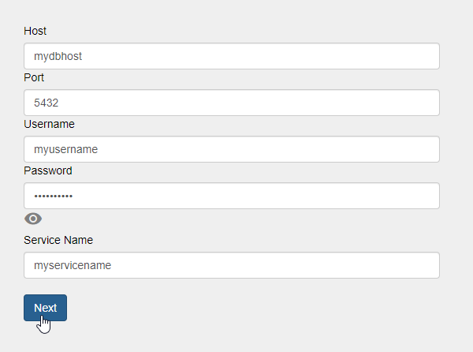
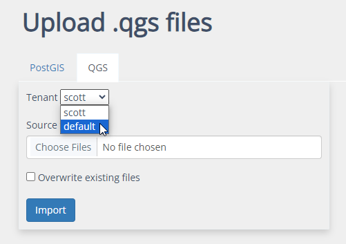
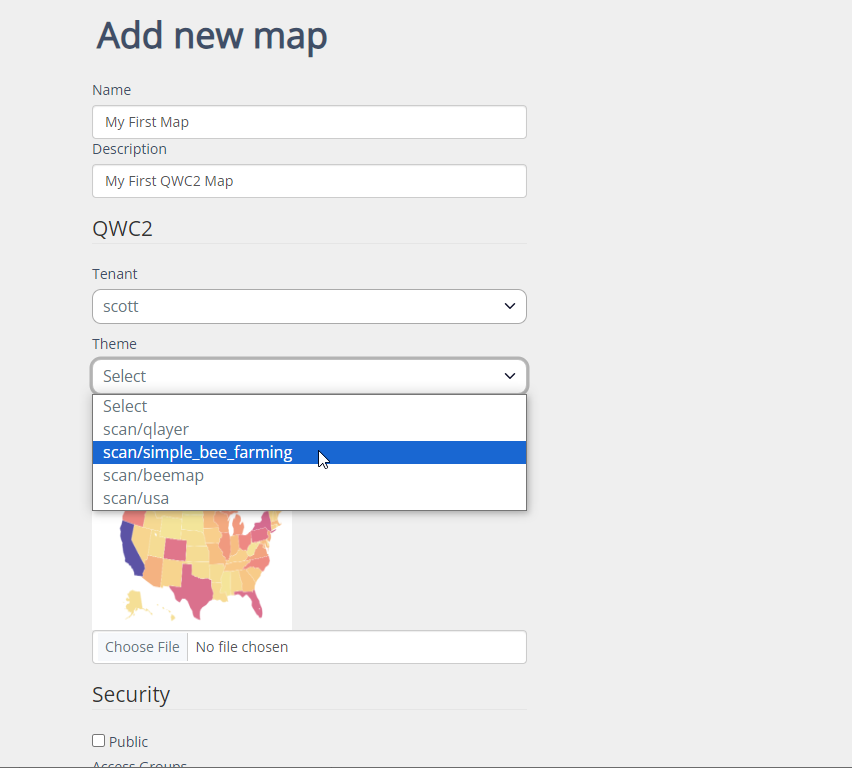

Quick Start
=====

This is a Quick Start Guide for our QWC2 Hosting.

Note that each item is covered in detail in subsequent sections of this documentation.

1. Log in to your control panel.
~~~~~~~~~~~~~~~~~~~~~~~~~~

  .. image:: images/qwc2_login.png

2. Go to Data Sources
---------------------------

On the Connections page, enter the connection details for your PostGIS connection

.. warning::
    Be sure to enter the Service name.    

 
3. Publish Your Project
~~~~~~~~~~~~~~~~~~~~~~~~~~

You have two options for publishing your QGIS Project

Option 1:  Upload Project usign control panel

Go to Data Sources > QGS and upload your QGIS Project

.. note::
    If you have created mutliple Tenants, be sure to select the Tenant for the Project. 

Option 2:  Upload using QWC2_Tool Plugin

Select the scan directory and click "Upload Project" as shown below    

.. image:: images/qwc_tools_0.png

.. note::
    If you have created mutliple Tenants, be sure to connect as the correct Tenant
  

4. Go to Maps > Add New
~~~~~~~~~~~~~~~~~~~~~~~~~~

Give your map a name and description and select the QGIS Project from the dropdown

There are a large number of features and options, but for now, just go scroll down to Security and select the existing User Group

  .. image:: images/Quick-Start-Login-12.png

Click Create
~~~~~~~~~~~~~~~~~~~~~~~~~~

ON the home page, click the link to your new map:

 .. image:: images/Quick-Start-Login-14.png

Your map has been published! 
~~~~~~~~~~~~~~~~~~~~~~~~~~

 .. image:: images/qwc_published.png

