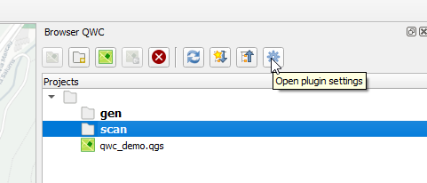
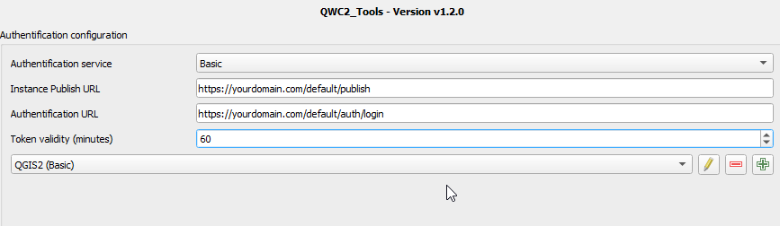
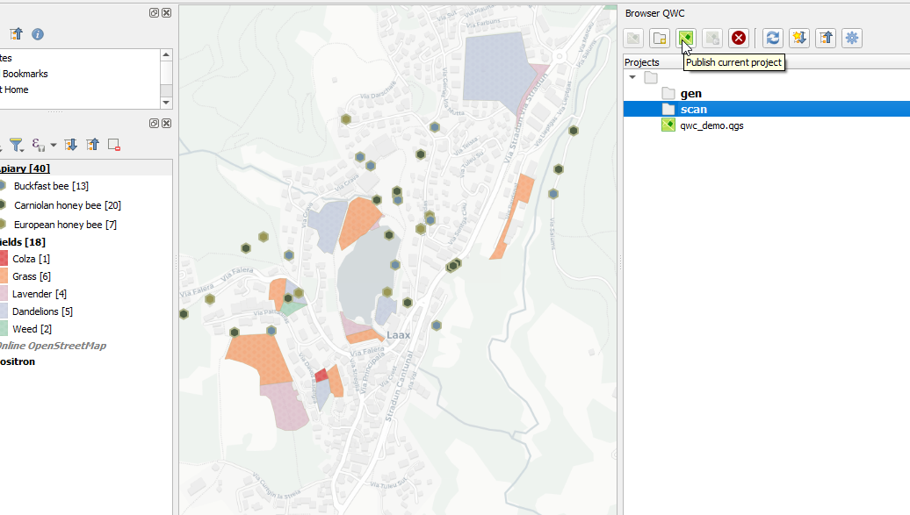

QWC2_Tools
======================

This section shows how to use the QWC2_Tools QGIS Plugin for publishing your maps.

.. note:: The QWC2_Toosls plugin is not required.  You can also publish your QGIS Projects by uploading them via your control panel.

1. Install the Plugin
---------------------------

The QWC2_Tools plugin can be installed using the QGIS Plugins Repository.

2. Settings
---------------------------

Click the Settings icon. 

This will open the Settings section as shown below.

3. Set Auth Type
---------------------------

For Auth Type, select Basic

Click the create new Configuration:

.. image:: images/qwc_tools_3.png

Enter your qwc_admin username and password.  Click Save

4. Set URLS
---------------------------

In the Instance Publish URL field, enter:

https://yourdomain.com/default/publish

Where 'yourdomain.com' is your QWC2 domain (or sub domain)

In the Authentication URL field, enter:

https://yourdomain.com/default/auth/login/

Where 'yourdomain.com' is your QWC2 domain (or sub domain)

.. note::
    If you have created mutliple Tenants, be sure to connect as the correct Tenant

5. Publish
---------------------------

Select the scan directory and click "Upload Project" as shown below

.. note::
    If you have created mutliple Tenants, be sure to connect as the correct Tenant  

 
