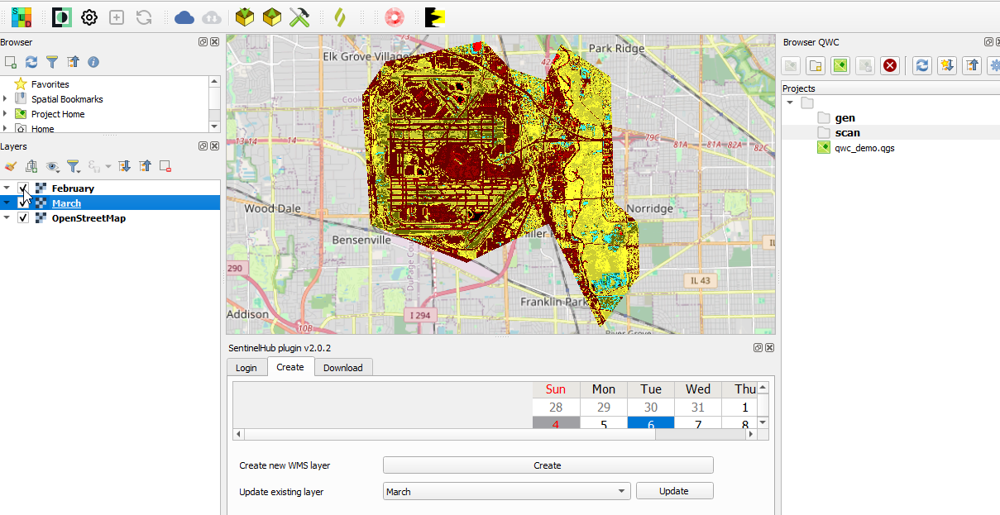
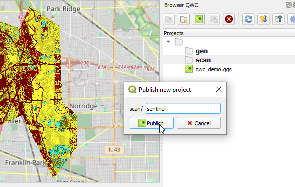
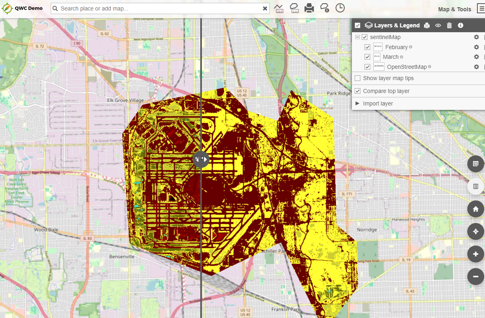
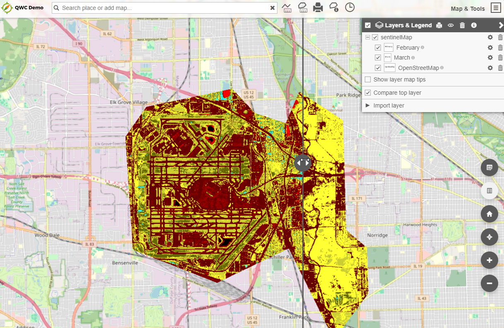

Sentinel Hub
=====

QWC2 has a built in compare function that allows you to compare layers.

Below is an example of how to use this with Sentinel Hub NDVI data

1.  Create Your QGIS Project using the Sentinel Hub QGIS Plugin

2.  Create two layers with differing dates that you wish to compare:

3. Publish your project as normal

4. Under Map Tools, go to Layers and Legends

Tick the "Compare top layer" box

You can now use the slider to compare the dates:

